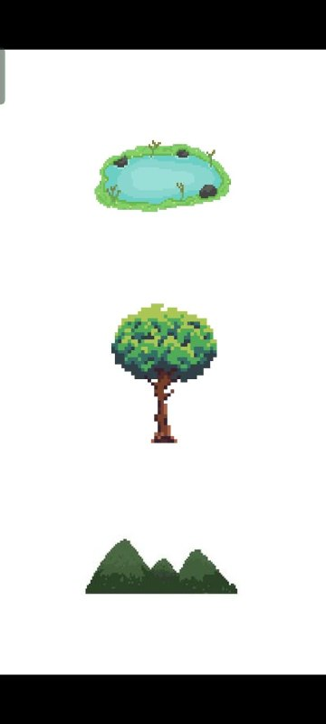
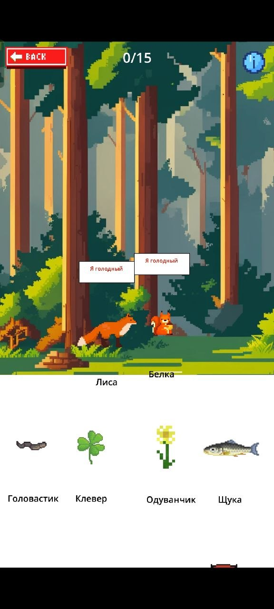
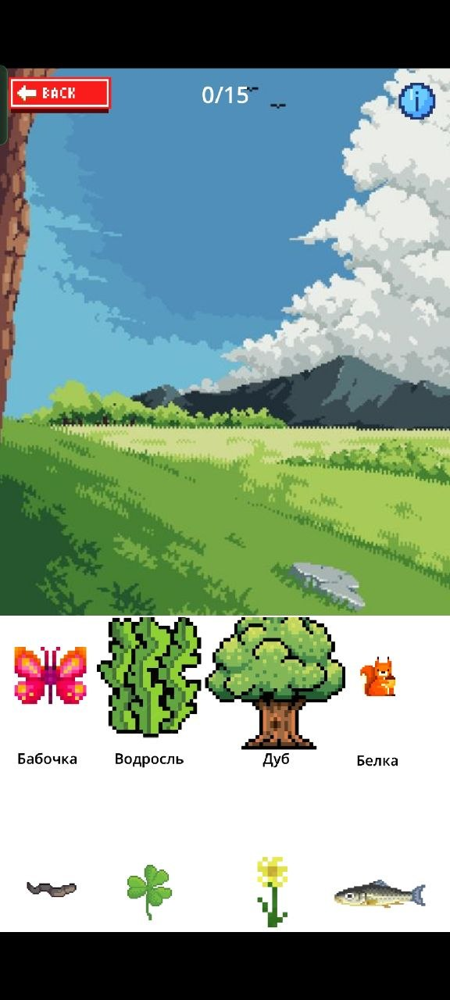
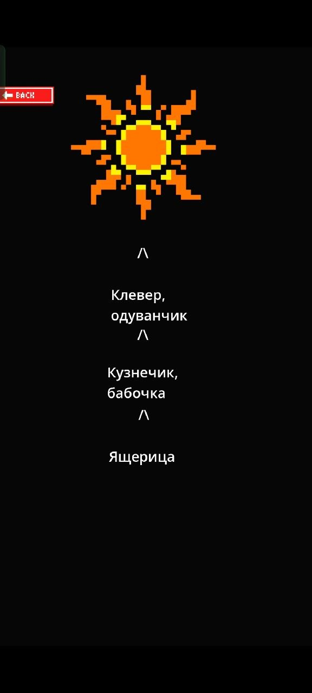
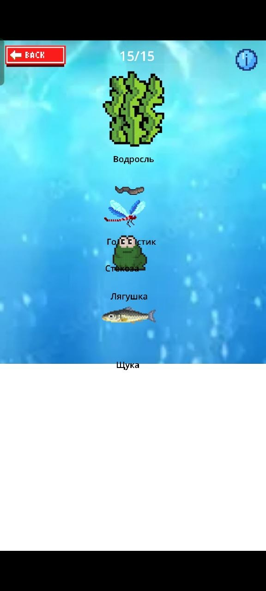

# 🌿 EcoPop

**EcoPop** — это простая мобильная игра-тренажёр по биологии, созданная в качестве дополнительного задания на Godot. Игра помогает в интерактивной форме понять, что такое **биогеоценоз** и как работают **пищевые цепи**.

## 🧠 О проекте

Игра предназначена для учеников **младших классов**, которые только начинают знакомиться с понятиями экосистемы и цепей питания. Никакой сложной механики — нужно лишь методом перетаскивания «заселить» три природные локации нужными животными так, чтобы все звенья цепи выжили.

Проект делался «на коленке» за короткий срок как быстрое наглядное пособие.

## 🎮 Геймплей

- На экране доступны **3 локации**: **Озеро**, **Лес** и **Луг**.
- Каждая локация — это свой уникальный биогеоценоз со своим правильным набором обитателей.
- В нижней части экрана находится `ScrollContainer` с карточками животных и растений.
- Игрок должен **перетащить** в локацию ровно 5 живых организмов, чтобы они могли устойчиво существовать.

**Правило выживания:**
Животное выживает, только если:
1. Оно находится в своём **правильном доме** (биотопе).
2. В этой же локации уже присутствует звено **ниже по пищевой цепи** (источник еды).

**Ключевая особенность — эффект домино:** Если у животного нет пищи или оно помещено не в свою экосистему, оно погибает. Вслед за ним автоматически погибнут **все хищники выше по цепи**, которые зависели от него как от кормовой базы.

## 🌍 Локации и пищевые цепи

### 1. Озеро
`Водоросли → Головастик → Стрекоза → Лягушка → Щука`

### 2. Лес
`Дуб (жёлуди) → Мышь, Белка → Лиса, Сова`

*(Примечание: мышь и белка конкурируют за жёлуди. Лиса может есть и мышей, и белок. Сова охотится на мышей).*

### 3. Луг
`Клевер, Одуванчик → Бабочка, Кузнечик → Ящерица`

## 📱 Установка

Игра скомпилирована только под **Android** (ввиду отсутствия iOS-устройства для тестирования).

1. Скачайте `.apk` файл из раздела [Releases](https://github.com/xl3p/EcoPop/releases/tag/1.0.1).
2. Перенесите файл на Android-устройство.
3. Разрешите установку из неизвестных источников в настройках.
4. Установите и запустите игру.

## 🛠️ Технические детали

- **Движок:** Godot Engine.
- **Платформа:** Android.
- **Статус проекта:** Учебный прототип, создан как дополнительное задание.

## 📦 Запуск из исходников

1. Склонируйте репозиторий.
2. Откройте проект в Godot Engine.
3. Запустите сцену `Main.tscn` для старта.
4. Для экспорта в `.apk` используйте стандартные шаблоны экспорта Godot для Android.

## Приложение

